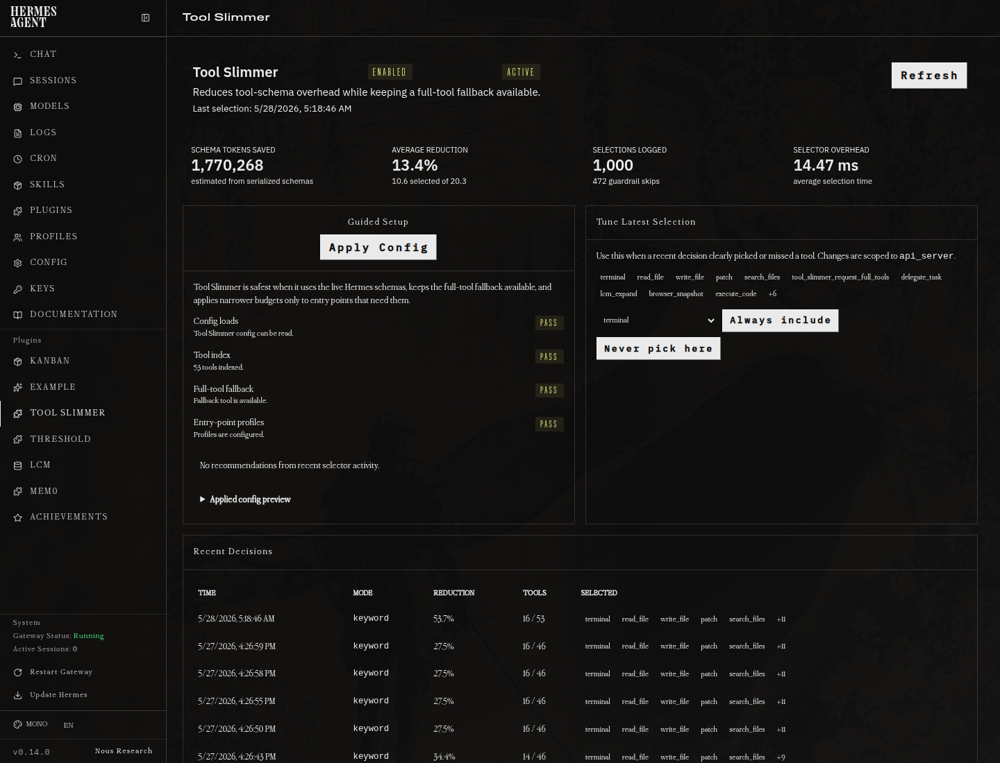

# Hermes Tool Slimmer

[](https://github.com/alias8818/hermes-tool-slimmer/actions/workflows/tests.yml)




Hermes Tool Slimmer reduces repeated tool-schema overhead by selecting the smallest useful tool set for a turn. It builds an indexable corpus from Hermes tool schemas, ranks candidate tools with local BM25 plus explicit boosts, and fails open to the original schema list when anything goes wrong.

## Support

For Tool Slimmer install bugs, dashboard issues, ranking misses, or configuration questions, please open an issue at [alias8818/hermes-tool-slimmer](https://github.com/alias8818/hermes-tool-slimmer/issues) instead of posting inside unrelated Hermes Agent issue threads. You can also reach Aliasocracy on Discord at `Aliasocracy#1439`; mention Hermes Tool Slimmer in the message so it is clear the contact is about this project.

## Why

Large Hermes installations can expose dozens of native and MCP tools. A 57-tool schema catalog can serialize to roughly 73 KB, or about 18K approximate prompt tokens using the documented `bytes / 4` estimate. Selecting 8-12 relevant tools for a repository-search turn can reduce that to about 15 KB / 3.7K approximate tokens while keeping configured safety tools hot.

Tool slimming is only a schema-selection optimization. It must not bypass Hermes approval prompts, tool execution controls, provider auth, disabled toolsets, or any runtime safety policy.

## What The Numbers Mean

The dashboard reports **estimated schema tokens saved**, not guaranteed billable-token savings. The estimate is computed from serialized tool-schema JSON bytes divided by 4 before and after selection. Provider tokenizers, prompt formatting, cache behavior, system prompts, conversation history, and model-specific tool serialization can make actual input-token and billing deltas differ.

The metric is still useful because it measures the repeated tool-catalog payload that Tool Slimmer removes from each request. Treat it as a consistent operational estimate for schema overhead, not as an invoice-grade accounting number.

Dashboard headline totals count real Hermes session events by default. Probe events without a `session_id` are excluded from headline savings and remain available through the dashboard API's `all_summary` field for audits.

## Install

Hermes Tool Slimmer v0.4.0+ is the supported line for Hermes Agent v0.14.0. Older Tool Slimmer releases can load as dashboard/diagnostic plugins on v0.14.0, but they do not provide active schema slimming because Hermes moved the request construction path.

On Hermes builds with dashboard plugin repair support, you can install from the dashboard **Plugins** page by pasting:

```text
alias8818/hermes-tool-slimmer
```

That path clones the repo to `~/.hermes/plugins/tool-slimmer`, runs the same deterministic repair installer with `--no-restart`, and preserves the git checkout so the dashboard **Update** button can use `git pull` later. Restart the gateway after dashboard install or update so active schema slimming uses the patched selector hook.

From a terminal on the machine that runs Hermes:

```bash
cd /tmp
git clone https://github.com/alias8818/hermes-tool-slimmer.git
cd hermes-tool-slimmer
```

Then run the installer:

```bash
scripts/install-hermes-tool-slimmer.sh
```

That handles the package install, dashboard plugin copy, Hermes plugin enablement, selector-hook patch, service restart, and final health report. The core patcher supports both the older monolithic `run_agent.py` Hermes layout and the newer v0.14.0 modular `agent/conversation_loop.py` plus `agent/chat_completion_helpers.py` layout.

Verify it worked:

```bash
hermes tool-slimmer doctor
```

When updating Hermes later, use the bundled update-and-repair helper:

```bash
scripts/update-hermes-and-repair-tool-slimmer.sh
```

It runs `hermes update --yes` so Hermes does not wait at the local-change restore prompt, keeps Hermes' normal backup behavior by default, reapplies the Tool Slimmer core hook if the update changed Hermes internals, restarts services, and finishes with the same doctor report.

For hands-off reboot recovery, enable the optional self-heal service:

```bash
scripts/self-heal-tool-slimmer.sh --install-systemd
```

On login/boot it runs `doctor`; if Tool Slimmer is enabled but the selector hook is missing, it reruns the local repair installer and restarts only active Hermes services. It does not run `git pull`, `hermes update`, or change config.

If an agent or hosted approval layer blocks direct script execution, run the same installer from a normal terminal, or ask the agent to request approval for this exact command after the repo is downloaded:

```bash
bash /tmp/hermes-tool-slimmer/scripts/install-hermes-tool-slimmer.sh
```

If the repo was unpacked somewhere else, replace `/tmp/hermes-tool-slimmer` with that directory. A block at this step means the environment denied running the script; it does not mean Hermes config or Tool Slimmer source is broken.

If the machine has multiple `hermes` launchers, use the Hermes venv launcher:

```bash
HERMES_BIN="$HOME/.hermes/hermes-agent/venv/bin/hermes" bash /tmp/hermes-tool-slimmer/scripts/install-hermes-tool-slimmer.sh
```

This avoids installing the package into one Python environment while running Hermes from another.

If Hermes Agent is doing the install for you, give it this instruction:

```text
Install Hermes Tool Slimmer from https://github.com/alias8818/hermes-tool-slimmer.
After downloading the repo, run:
HERMES_BIN="$HOME/.hermes/hermes-agent/venv/bin/hermes" bash /tmp/hermes-tool-slimmer/scripts/install-hermes-tool-slimmer.sh
If the environment asks for approval to run that script, request approval for that exact command.
Then verify with:
$HOME/.hermes/hermes-agent/venv/bin/hermes tool-slimmer doctor
```

For a guided setup, see [`docs/guided-setup.md`](docs/guided-setup.md) and [`docs/quickstart.md`](docs/quickstart.md). For the Hermes dashboard page, see [`docs/dashboard-plugin.md`](docs/dashboard-plugin.md).

The dashboard includes a **Guided Setup** card, **Tool Index** panel, one-click **Rebuild From Hermes Tools** action, **Apply Recommended Config** button with backup creation, indexed-tool preview, path, checksum, and last-updated time. The persisted index is for inspection and troubleshooting; live slimming ranks the current request's Hermes schemas in memory.

For a plain-English health report:

```bash
scripts/troubleshoot-hermes-tool-slimmer.sh
```

For local development:

```bash
pip install -e ".[dev]"
pytest
```

## Quality Gates

The repository ships focused unit and integration tests for selector behavior, config validation, metrics accounting, dashboard API routes, and provider fallback behavior. Run the same checks used by CI locally:

```bash
ruff check .
python -m compileall -q src tests dashboard-plugin/tool-slimmer
pytest -q
```

## Configure

```yaml
plugins:
  enabled:
    - tool-slimmer

tool_slimmer:
  enabled: true
  mode: keyword        # eager | keyword | hybrid | anthropic_tool_search | two_pass
  top_k: 8             # selected after always_include
  always_include: [terminal, read_file, write_file, patch, search_files]
  always_exclude: []   # alias for disabled_tools; useful for noisy tools in text-only deployments
  never_defer: [terminal, read_file]
  include_mcp_tools: true
  include_native_tools: true
  log_decisions: true
  min_total_tools: 0
  min_estimated_reduction_percent: 5.0
  min_score: 0.25
  aliases:
    browse: [browser, navigate, url, website]
  two_pass:
    hydrate_limit: 8
    max_catalog_tools: 120
    cache_hydrated_tools: true
    fallback_to_keyword: true
  profiles:
    telegram:
      top_k: 4
      always_include: [memory, tool_slimmer_request_full_tools]
      always_exclude: [terminal, cronjob]
    slack:
      top_k: 6
      always_include: [memory, read_file, search_files, tool_slimmer_request_full_tools]
      always_exclude: [cronjob]
    cli:
      top_k: 8
  fail_open: true      # selector errors preserve the original full schema list
  dry_run: false       # true logs/injects diagnostics but does not alter schemas
```

### Experimental Two-Pass Mode

`mode: two_pass` is opt-in and experimental. It is intended for very large tool catalogs, text-first gateways, or TPM-capped providers where even a keyword-trimmed full-schema set is too expensive.

In two-pass mode, the first request receives your `always_include` tools plus `tool_slimmer_hydrate_tools`. That hydration tool carries a compact deterministic catalog of available tool names, one-line descriptions, toolsets, and tags. If the model needs tools, it calls `tool_slimmer_hydrate_tools` with multiple names in one batch; the next request exposes those full schemas and caches them for the session when `cache_hydrated_tools: true`.

Keep `keyword` as the default for normal use. Two-pass can add one extra model round trip before tool use, and current Hermes history may still record the compact hydration tool call. It avoids external delegation and avoids injecting the full catalog on ordinary no-tool turns.

## Commands

```bash
hermes tool-slimmer status
hermes tool-slimmer doctor
hermes tool-slimmer index rebuild --schemas examples/tools.yaml
hermes tool-slimmer index show --top 20
hermes tool-slimmer select "search this repo for MCP registration code" --schemas tools.yaml
hermes tool-slimmer benchmark --prompts examples/prompts.yaml --schemas examples/tools.yaml
hermes tool-slimmer eval --prompts examples/prompts.yaml --schemas examples/tools.yaml
hermes tool-slimmer eval --prompts examples/prompts.yaml --schemas examples/tools.yaml --markdown
hermes tool-slimmer analyze-config
hermes tool-slimmer advisor
hermes tool-slimmer advisor --apply
hermes tool-slimmer advisor --rollback ~/.hermes/tool-slimmer/backups/config-YYYYmmdd-HHMMSS.yaml
hermes tool-slimmer privacy
hermes tool-slimmer recommend-config
```

Slash commands:

```text
/tool-slimmer status
/tool-slimmer select search this repo for MCP registration code
/tool-slimmer dry-run on
/tool-slimmer dry-run off
```

## Provider behavior

| Provider path | Behavior |
|---|---|
| Anthropic native | Tool Search/defer loading if `mode: anthropic_tool_search` and Hermes core supports the required request serialization/headers. |
| Bedrock/Vertex/Azure Anthropic | Attempt only when the Hermes provider stack supports the Anthropic Tool Search path for that provider/model. |
| OpenRouter/OpenAI/local | Fall back to deterministic keyword selection, hybrid when implemented, or eager mode according to config; do not send Anthropic-only Tool Search definitions. |

## Integration status

The standalone plugin registers diagnostics tools, the full-tool fallback tool, slash commands, CLI commands, a short `pre_llm_call` fallback instruction, and a `select_tool_schemas` callback when Hermes core supports it.

Supported/target core surfaces:

- `ctx.register_tool_schema_selector(callback)`
- `ctx.register_schema_selector(callback)`
- `ctx.register_hook("select_tool_schemas", callback)`

If none exists, active schema slimming requires the installer/core patch to add `select_tool_schemas` before provider request construction. Without that core hook, the plugin remains useful for dashboard visibility, dry-run diagnostics, benchmarking, and configuration recommendations, but it cannot reduce provider request schemas. See `docs/hermes-core-selector-hook.patch` for a minimal upstreamable Hermes core patch artifact based on current v0.14.0 source inspection.

## Safety model

- `always_include` tools are selected first when present and not already disabled by Hermes.
- `always_exclude` is a user-facing alias for `disabled_tools`. Use it when a tool is too noisy for a deployment and should only appear through Hermes outside Tool Slimmer's ranked set.
- `tool_slimmer_request_full_tools` is always kept available when Hermes has registered it. If a skill or task needs a hidden tool, the model can call it to make the next provider request use the full schema list instead of inventing a substitute workflow.
- `top_k` applies after `always_include`; always-included tools do not count against the `top_k` budget. `top_k: 0` is treated as an explicit request to select no ranked tools, so it does not fail open to the full catalog.
- `disabled_tools`, `disabled_toolsets`, `include_mcp_tools`, and `include_native_tools` are respected before ranking.
- `profiles` let Slack, Telegram, CLI, cron, and webhook entry points use different `top_k`, include, and exclude lists without making every user interface share the same tradeoff.
- Low-information messages such as `hello`, `ping`, `thanks`, or numeric retry nudges do not rank task tools. They keep only `always_include` plus the full-tool fallback.
- `min_score` prevents tiny positive keyword matches from filling every `top_k` slot.
- `min_total_tools` skips catalogs with fewer than that many tools before ranking; equality is allowed to slim. The default is `0` so subagents and restricted toolsets still get ranked.
- `min_estimated_reduction_percent` fails open after ranking if the estimated schema reduction is too small to justify altering the request. In `anthropic_tool_search` mode, this guardrail is measured against the hot tool set because deferred tools are discoverable rather than eagerly loaded.
- `fail_open: true` sends the original schema list on selector errors.

Keyword mode is intentionally mostly literal. It includes a small deterministic synonym map for common operation words such as browsing/navigation, but tool-specific synonyms should still be added to tool descriptions or handled by a semantic selector mode when available.
- `aliases` extends keyword query expansion deterministically; aliases affect ranking and score details but do not rewrite stored tool schemas.
- `hybrid` mode keeps BM25 ranking and adds a deterministic fuzzy-token boost for close spelling/wording misses.
- For most installs, start with `mode: keyword` and `top_k: 8`. Lower values such as `top_k: 4` can work for narrow Telegram/webhook deployments, but they raise tool-miss risk unless paired with explicit `always_include` and `always_exclude` choices.
- The standalone `tool_slimmer_select` tool uses provided schemas first, live Hermes tool definitions second, and the persisted index as a final fallback.
- `dry_run: true` logs decisions and returns `None` to preserve original behavior.
- Anthropic Tool Search helpers never defer every tool.


## Public release contents

- [`docs/quickstart.md`](docs/quickstart.md): install, dry-run, and activation walkthrough.
- [`docs/hermes-core-integration.md`](docs/hermes-core-integration.md): required Hermes core selector hook contract.
- [`docs/hermes-core-selector-hook.patch`](docs/hermes-core-selector-hook.patch): minimal upstreamable Hermes core patch artifact.
- [`docs/anthropic-tool-search.md`](docs/anthropic-tool-search.md): provider capability notes for Anthropic Tool Search.
- [`docs/privacy.md`](docs/privacy.md): decision log field inventory and privacy notes.
- [`docs/reports/latest-eval.md`](docs/reports/latest-eval.md): reproducible example evaluation report.
- [`docs/troubleshooting.md`](docs/troubleshooting.md): common operational issues.
- [`examples/`](examples/): sample config, prompts, schemas, and expected output.

## Release validation

This repository is release-ready only when these checks pass:

```bash
ruff check .
mypy src tests
python -m compileall -q src tests
pytest -q
python -m build
```

When changing the Hermes core patch, also run the validation steps in [`docs/release-checklist.md`](docs/release-checklist.md).
